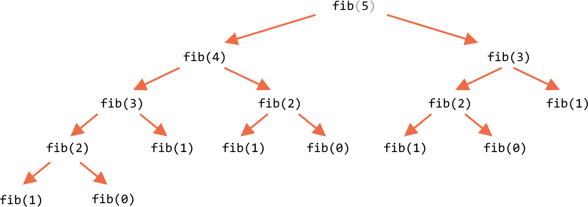

import { Head } from 'mdx-deck'

export { default as theme } from '../theme'

<Head>
  <title>Dynamic Programming</title>
</Head>

# Dynamic Programming


by Max Strübing  
([twitter](https://twitter.com/mxstrbng), [github](https://github.com/mstruebing))

---

Makes your algorithm more efficient by storing intermediate results.

---

Now, as always: __FIBONACCI__

---

f(0) = 0  
f(1) = 1

f(n) = f(n-1) + f(n-2)

---

(0) 1 1 2 3 5 8 13 21 ...

---

Recursive approach:

```js
const fib = n => {
    if (n < 2) {
        return n;
    }

    return fib(n-1) + fib(n-2);
}
```

---

```
fib(5) // 5
```

---

Computation

---

```
fib(5)
```

---

```
fib(5)
fib(4) + fib(3)
```

---

```
fib(5)
fib(4) + fib(3)
(fib(3) + fib(2)) + (fib(2) + fib(1))
```

---

```
fib(5)
fib(4) + fib(3)
(fib(3) + fib(2)) + (fib(2) + fib(1))
((fib(2) + fib(1)) + (fib(1) + fib(0))) + ((fib(1) + fib(0)) + fib(1))
```

---

```
fib(5)
fib(4) + fib(3)
(fib(3) + fib(2)) + (fib(2) + fib(1))
((fib(2) + fib(1)) + (fib(1) + fib(0))) + ((fib(1) + fib(0)) + fib(1))

(((fib(1) + fib(0)) + fib(1)) + (fib(1) + fib(0))) + ((fib(1) + fib(0)) + fib(1))
```

---



---

we calculate: 
* 3 times `fib(0)`
* 5 times `fib(1)` 
* 3 times `fib(2)`
* 2 times `fib(3)`

---

```
O(2^n)

fib(n) = fib(n-1) + fib(n-2)
```

---

We often recalculate already calculated results.

---

We often recalculate already calculated results.  
Why not store these intermediate results we already computed?

---

Memoization

---

Passing an array with already calculated results as a parameter.

---

```js 
const fibMemoized = (n, memo = []) => {
  if (n < 2) {
    return n;
  }

  if (n in memo) {
    return memo[n];
  }

  result = fibMemoized(n-1, memo) + fibMemoized(n-2, memo);
  memo[n] = result;

  return result;
};
```

---

```
fib(5) // 5
```

---

Computation:

```
fib(5)
```

---

```
fib(5)
fib(4) + fib(3)
(fib(3) + fib(2)) + (fib(2) + fib(1))
((fib(2) + fib(1)) + (fib(1) + fib(0))) + ((fib(1) + fib(0)) + fib(1))

(((fib(1) + fib(0)) + fib(1)) + (fib(1)+ fib(0))) + ((fib(1)+ fib(0)) + fib(1))
```

---

```
fib(5)
fib(4) + fib(3)(cache)
(fib(3) + fib(2)(cache)) + (fib(2)(cache) + fib(1)(cache))
((fib(2) + fib(1)(cache)) + (fib(1)(cache) + fib(0)(cache))) + ((fib(1)(cache) + fib(0)(cache)) + fib(1)(cache))

(((fib(1) + fib(0)) + fib(1)(cache)) + (fib(1)(cache) + fib(0)(cache))) + ((fib(1)(cache) + fib(0)(cache)) + fib(1)(cache))

```

---

```
O(n)
```

---

Bottom up:

---

No recursion, just a loop.

---

```js
const fib = n => {
    if (n < 2) {
        return n;
    }

    const bottom = [];
    bottom[1] = 0;
    bottom[2] = 1;
    
    for (let i = 3; i <= n; i++) {
        bottom[i] = bottom[i-1] + bottom[i-2];
    }

    return bottom[n];
}
```

---

Same Computation as memoized but:

---
 
Same Computation as memoized but:   
=> less function calls 

---
 
Same Computation as memoized but:  
=> less function calls  
=> less overhead  

---
 
Same Computation as memoized but:  
=> less function calls  
=> less overhead  
=> less computation power needed 

---
 
Same Computation as memoized but:  
=> less function calls  
=> less overhead  
=> less computation power needed  
=> faster.

---

```
const targetFib = 10;

console.time('recursive took');
console.log(`recursive result: ${fibRecursive(targetFib)}`);
console.timeEnd('recursive took');
console.log();

console.time('memoized took');
console.log(`memoized result: ${fibMemoized(targetFib)}`);
console.timeEnd('memoized took');
console.log();

console.time('bottom up took');
console.log(`bottom up result: ${fibBottomUp(targetFib)}`);
console.timeEnd('bottom up took');
console.log();
```

---

```
$ node fib.js
recursive result: 55
recursive took: 1.662ms

memoized result: 55
memoized took: 0.160ms

bottom up result: 55
bottom up took: 0.084ms
```

---

Let us change the `targetFib` to 45.

---

```
$ node fib.js
recursive result: 1134903170
recursive took: 17593.078ms

memoized result: 1134903170
memoized took: 0.254ms

bottom up result: 1134903170
bottom up took: 0.093ms
```

---

We can see that the recursive approach took 17.5 seconds and the other ones doesn't even need a second to finish their computation.

---

Dynamic Programming

---

Dynamic Programming

Is an optimization over plain recursion.  
If the recursion often evaluates the same function calls you could store the results of these function calls and access them when needed instead of recalculating them everytime.

---

Dynamic Programming

Is an optimization over plain recursion.  
If the recursion often evaluates the same function calls you could store the results of these function calls and access them when needed instead of recalculating them everytime.

**Makes your algorithm more efficient by storing intermediate results.**

---

Some Links:

* https://en.wikipedia.org/wiki/Dynamic_programming
* https://en.wikipedia.org/wiki/Fibonacci_number
* https://www.geeksforgeeks.org/dynamic-programming/

---

Thank you
