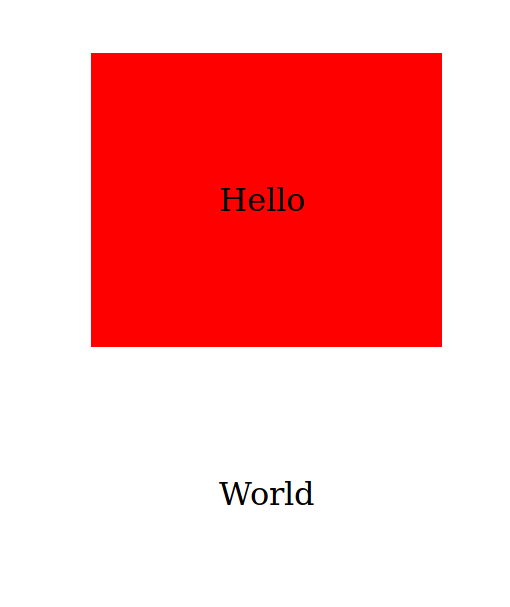
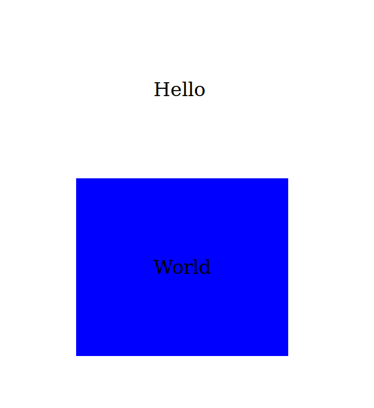

import { Head } from 'mdx-deck'

export { default as theme } from '../theme'

<Head>
  <title>Higher Order Components</title>
  <meta name="author" content="Max Strübing" />
</Head>

# Higher Order Components
by Max Strübing  
([twitter](https://twitter.com/mxstrbng), [github](https://github.com/mstruebing))

---

What is a Higher Order Component?

---

A higher-order component (HOC) is an advanced technique in React for reusing component logic. HOCs are not part of the React API, per se. They are a pattern that emerges from React’s compositional nature.
(source: https://reactjs.org/docs/higher-order-components.html)

---

What does that mean?

---

Concretely, **a higher-order component is a function that takes a component and returns a new component**.
(source: https://reactjs.org/docs/higher-order-components.html)

---

Takes a component and returns a component

---

Show me an example

---

enhanceComponentWithLog gets a Component and the result is rendered

```js
class MyComponent extends React.Component {
  render() {
    const Component = () => <div>Hello!</div>
    const EnhancedComponent = enhanceComponentWithLog(Component)

    return <EnhancedComponent />
  }
}
```

---

enhanceComponentWithLog gets a Component does a console.log and returns the Component

```js
const enhanceComponentWithLog = Component => {
  console.log(`Component ${Component()} rendered`)
  return Component;
}
```

---

Concretely, **a higher-order component is a function that takes a component and returns a new component**.

---

This can be used to do all kinds of things, mainly to enhance a component with other features which are not part of the component itself or to share
logic of features between components.

hover state, data fetching, clickhandler, ...

---

Example:

# Click Counter

---

```js
const enhanceWithClickCounter = Component => {
  return class withClickCounter extends React.Component {
    state = {
      clicks: 0
    }

    increaseClicks = () => {
      this.setState(prevState => ({
        clicks: prevState.clicks + 1
      }))
    }

    render() {
      const {clicks} = this.state

      return (
        <>
        <div onClick={this.increaseClicks}>
          {clicks}
          <Component />
        </div>
        </>
      )
    }
  }
}
```

---

```js 
class App extends Component {
  render() {
    const EnhancedHelloComponent = enhanceWithClickCounter(() => <div>Hello</div>)
    const EnhancedWorldComponent = enhanceWithClickCounter(() => <span>World</span>)

    return (
      <>
        <EnhancedHelloComponent />
        <EnhancedWorldComponent />
      </>
    );
  }
}
```

---

  

---

# Example 2:

Background change on hover

---

```js
export default class App extends Component {
  render() {
    const RedComponent = enhanceWithBackgroundHover(() => <div>Hello</div>)("red")
    const BlueComponent = enhanceWithBackgroundHover(() => <div>World</div>)("blue")
    return (
      <div>
        <RedComponent/>
        <BlueComponent/>
      </div>
    );
  }
}
```

---

```js
const enhanceWithBackgroundHover = Component => color => {
  return class withBackgroundHover extends React.Component {
    render() {
      return (
        <div class={`background ${color}`}>
          <Component />
        </div>
      )
    }
  }
}
```

---

  

-----

  

---

resources:

[react documentation](https://reactjs.org/docs/higher-order-components.html)
